# 💸 Finance App (Frontend)

A modern, responsive web application for managing personal finances, tracking expenses, and organizing digital wallets. This project focuses on a seamless user experience, complex state management, and polished UI interactions.

## 📺 Project Presentation

Our team presented this project, showcasing its full functionality. You can watch the walkthrough with English subtitles here:
👉 **[Watch Project Presentation on YouTube](https://www.youtube.com/watch?v=0jhBfZ_Dv_M)**

## 🚀 Key Features (My Core Contributions)

While I worked as part of a team, I was responsible for the **core logic and functional modules** of the application:

- **Wallet Management:** Complete CRUD functionality for digital wallets, including name editing and balance displays.
- **Transaction System:**
  - Advanced system for adding income/expenses.
  - Category-based organization with custom icons.
  - Dynamic grouping of transactions by Month and Year.
  - Context-aware forms (filtering wallets based on where the transaction is created).
- **Global State Management:** Architected the **React Context** logic for Wallets and Transactions to ensure high performance and data persistence across the app.
- **UI/UX Enhancements:** Implemented all interactive **Framer Motion** animations, modal windows, and responsive layouts using **Tailwind CSS**.

## 👥 Team & Roles

- **Mykhailo Parm(Lead):** Project architecture, mentorship, and technical guidance.
- **Mykyta Shevchenko(Me):** Core Frontend Developer (Dashboard, Wallets, Transactions).
- **Anastasia:** Implementation of the Authentication system (including Google OAuth) and the Reports (Charts) module.

## 🛠 Tech Stack

- **Core:** React + TypeScript
- **Routing:** `react-router-dom`
- **API Client:** Axios (HTTP requests & error handling)
- **Styling:** Tailwind CSS & Motion (Animations)
- **Forms & Validation:** `react-hook-form`
- **UI Components:**
  - `sonner` (Toast notifications)
  - `react-icons` (Scalable vector icons)
  - `react-datepicker` (Customizable date selection)

## 📸 Screenshots

| Authorization Page                              | Registration Page                         | Success Toast                       | Error Toast                     |
| :---------------------------------------------- | :---------------------------------------- | :---------------------------------- | :------------------------------ |
| 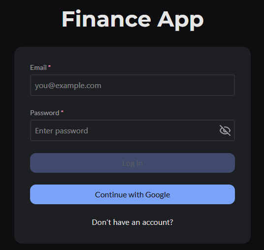 | 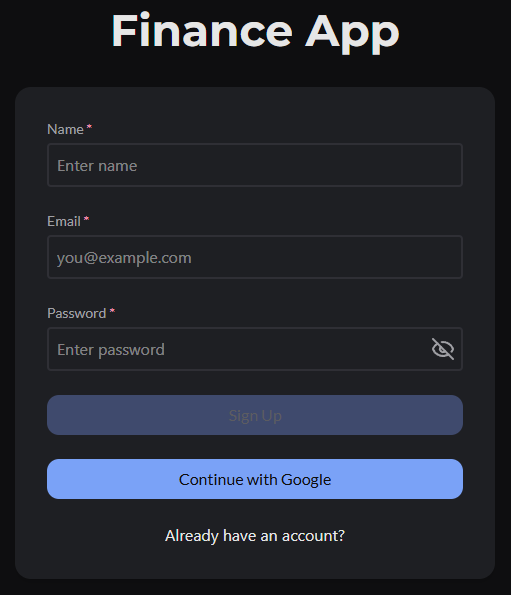 | 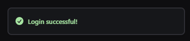 | 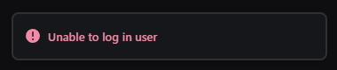 |

| Sidebar                             | Dashboard                               | Wallets                             | WalletDetail                                  |
| :---------------------------------- | :-------------------------------------- | :---------------------------------- | :-------------------------------------------- |
| 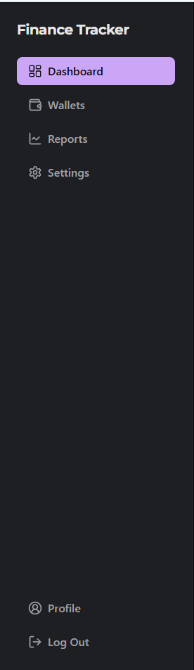 | 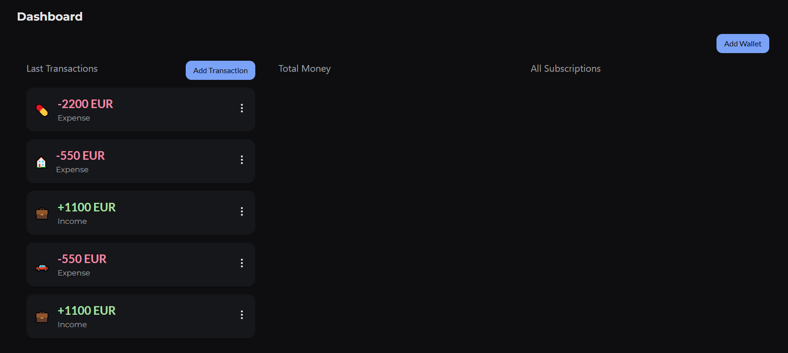 | 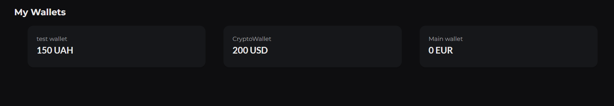 | 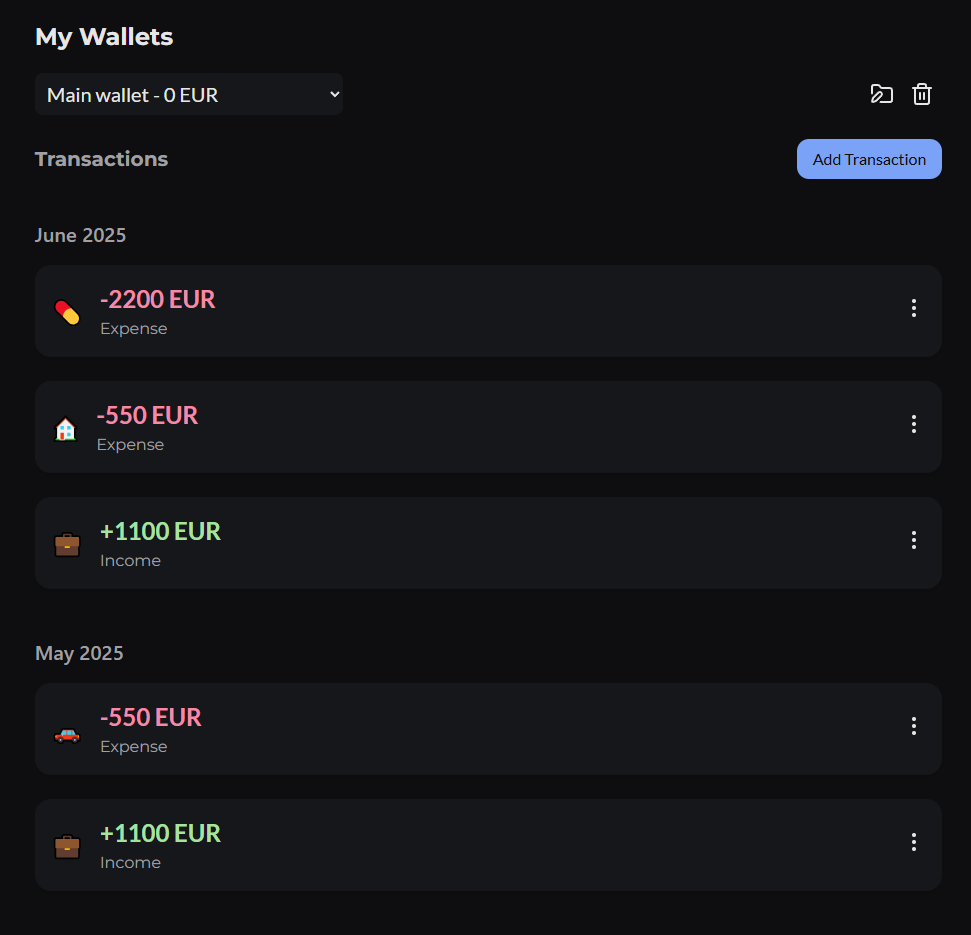 |

| Create Wallet                                   | Edit Wallet                                 | Delete Wallet                                   |
| :---------------------------------------------- | :------------------------------------------ | :---------------------------------------------- |
|  |  | 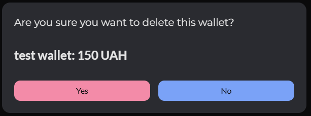 |

| Create Transaction from Dashboard                                                  | Create Transaction from WalletDetail Page                                                     | Edit Transaction                                      | Delete Transaction                                        | Customized Date Picker                                           |
| :--------------------------------------------------------------------------------- | :-------------------------------------------------------------------------------------------- | :---------------------------------------------------- | :-------------------------------------------------------- | :--------------------------------------------------------------- |
| 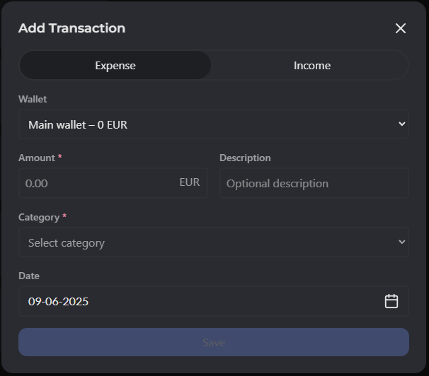 | 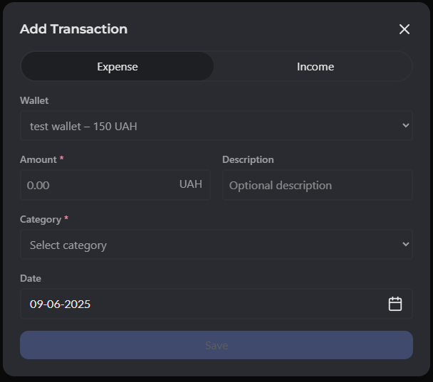 | 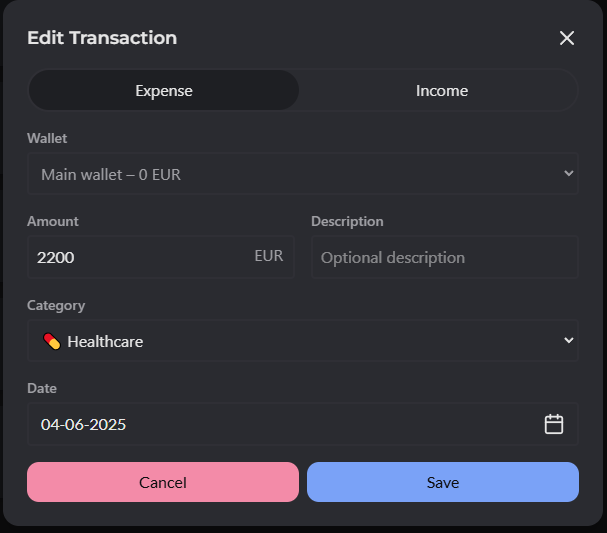 | 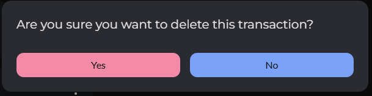 | 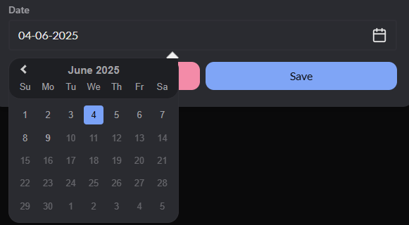 |

---

## 📂 Configuration & Environment

The application uses an `.env` file for backend connectivity:

```env
VITE_API_BASE_URL=[https://finance-app-backend-dev.onrender.com/api](https://finance-app-backend-dev.onrender.com/api)
VITE_SUPABASE_URL=...
VITE_SUPABASE_ANON_KEY=...

Note: The original backend and Supabase instance are currently offline. This repository focuses on the frontend architecture and UI implementation.

Developed as a collaborative team project to build a real-world financial management tool.
```
